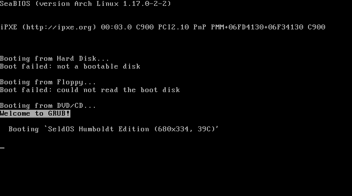
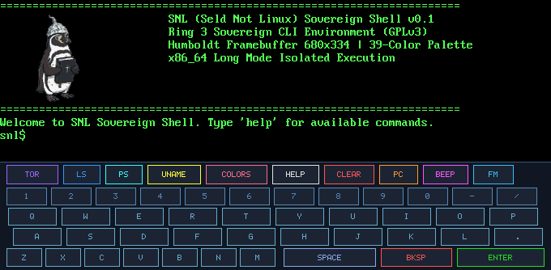
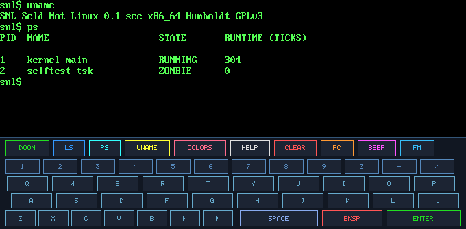
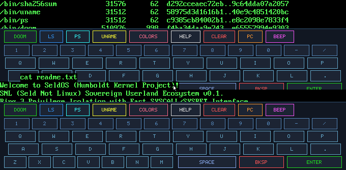
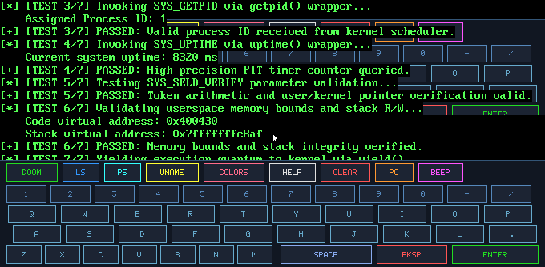
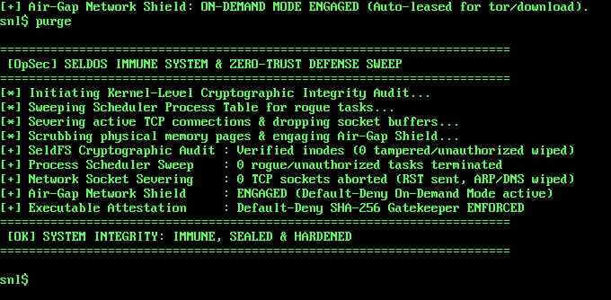
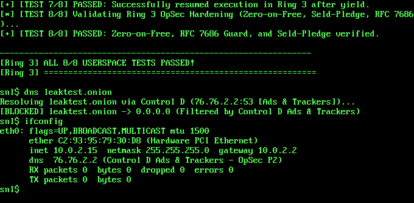
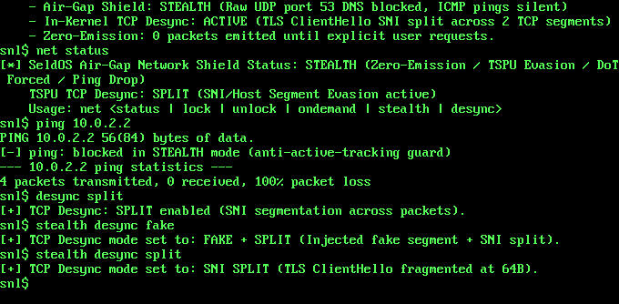

# SeldOS (Humboldt Kernel Project)
### Hardened 64-bit Operating System, Seld Not Linux Userspace & Mobile DOOM Edition
**Copyright (C) 2026 Free Software Foundation, Inc.**  
*Licensed under the GNU General Public License version 3 (GPLv3).*

<p align="center">
  <br>
  <b>Пингвин Гумбольдта в шапочке из фольги с Библией — официальный суверенный маскот SeldOS</b>
</p>

---

## 1. Манифест и архитектурная философия проекта

**SeldOS** — бескомпромиссная 64-битная операционная система реального режима x86_64, спроектированная с чистого листа на ассемблере NASM и стандарте C99. Проект категорически отвергает современные тенденции многослойного абстрактного bloatware: в SeldOS нет ядра Linux, чужих рантаймов, неподконтрольных фоновых демонов или нагромождений glibc/musl. Каждый машинный цикл, регистр управления процессора (`CR0`, `CR2`, `CR3`, `CR4`), таблица дескрипторов (GDT/IDT/TSS), 4-уровневая таблица страниц PML4 и MSR-регистры управляются напрямую собственным кодом ядра.

### Инженерные принципы и системный базис:
- **Маскот проекта — Пингвин Гумбольдта (*Spheniscus humboldti*) в шапочке из фольги с Библией:**
  Подобно тому, как пингвин Tux стал символом Linux, а чертенок Beastie — символом BSD, пингвин Гумбольдта в шапочке из фольги со священным писанием в лапках выбран официальным маскотом SeldOS. Этот образ олицетворяет бескомпромиссную суверенную безопасность, параноидальную защиту личных данных (OpSec), следование традициям свободного ПО (GPLv3) и независимость от внешних корпоративных монополий.
  - Векторные исходники: [`seldos_logo.svg`](seldos_logo.svg) и компактный встроенный образ [`seldos_logo.svgz`](seldos_logo.svgz) (GZIP-сжатый векторный файл, 74 KiB).
  - Векторное изображение строго квантовано по **39-цветной палитре Humboldt Palette** (0 цветов вне системного реестра).
- **Низкоуровневое растровое квантование (Разрешение 680×334):**
  Вместо произвольных стандартных разрешений компьютерной индустрии, геометрия фреймбуфера 680×334 жестко оптимизирована под безмасштабный рендеринг растрового консольного шрифта $8 \times 16$ и локальность данных в кэше процессора:
  - **Ширина 680 px:** Точно $680 / 8 = 85$ символьных колонок. Стандартная 80-колоночная текстовая разметка размещается с фиксированным запасом в 5 колонок (40 пикселей) под системные индикаторы, маркеры состояния и отступы без дорогостоящих вычислений межсимвольных интервалов.
  - **Высота 334 px:** Точно 20 полноценных текстовых строк по 16 пикселей ($20 \times 16 = 320\text{ px}$) плюс аппаратно зафиксированная нижняя охранная полоса в 14 пикселей ($320 + 14 = 334\text{ px}$), используемая под статусную панель, разделители окон и системный буфер.
  - **Кэш-локальность и субмегабайтный линейный фреймбуфер:** Общий размер 32-битного кадрового буфера составляет $680 \times 334 \times 4\text{ байта} = 908{,}480\text{ байт}$ ($\approx 887.2\text{ KiB}$). Он целиком укладывается в непрерывный физический диапазон менее 1 МиБ (L2/L3 кэш современных процессоров), гарантируя молниеносный unaccelerated software blitting через `memmove`/`memcpy` без промахов кэша и без необходимости пересечения многомегабайтных MMIO-границ.
- **Фиксированная 39-цветная палитра (Humboldt Palette):**
  В видеоподсистеме зафиксирована детерминированная палитра из 39 цветов с прямым отображением в RGB32:
  - **0..15:** Полная совместимость со стандартной 16-цветной ANSI/VGA-палитрой для консольных утилит и терминальных эмуляторов.
  - **16..26:** Высококонтрастные эргономичные монохроматические и сигнальные токены (угольный фон `0x18181A`, аспидные панели `0x2A2D34`, чистый белый текст `0xF2F4F8`, теплый песочный `0xE5D9C5`, сигнальный красный `0xE0533C`), рассчитанные на идеальное считывание текста шрифтами 8×16 и 5×7 без субпиксельного сглаживания.
  - **27..38:** Расширенные спектральные токены (глубокий индиго, пелагический синий, акцентный циан, золотистая охра, базальтовый серый) для отрисовки TUI-интерфейсов, двухпанельного файлового менеджера, сетевых графиков и трансляции палитры DOOM.
- **Строгая аппаратная изоляция памяти (W^X & Privilege Separation):**
  - Разделение привилегий на уровне процессора: супервизор ядра работает в Ring 0 (CPL = 0), все программы пользователя — в Ring 3 (CPL = 3).
  - Аппаратное правило **W^X (Write XOR Execute)**: секции исполняемого кода `.text` имеют флаги `RX` (`User=1, Write=0, NX=0`), а секции данных, стека и кучи — `RW, NX` (`User=1, Write=1, NX=1`).
  - Активация `EFER.NXE` (бит 11 MSR `0xC0000080`) и `CR0.WP` (бит 16) защищает структуры ядра от перезаписи из супервизора.
  - Каждое обращение к пользовательским буферам в системных вызовах проходит строгую валидацию границ канонического адреса (`validate_user_buffer`).
- **Аппаратный гейткипинг бинарников и Air-Gap On-Demand (Zero-Trust Immunity):**
  - **Криптографическая аттестация ELF:** ядро в `elf_load_and_run` аппаратно проверяет SHA-256 каждого исполняемого файла перед загрузкой в адресное пространство и сверяет с белым списком доверенных утилит. Запуск недоверенных бинарников, модифицированных файлов и вредоносных пейлоадов блокируется на уровне Ring 0.
  - **Air-Gap On-Demand Network Shield:** сетевой трафик по умолчанию заглушен на уровне драйверов (`nic_send_packet` / `SYS_NET_TCP_CONNECT`). Временная аренда (lease) выдается исключительно доверенным бинарникам (`/bin/tor`, `/bin/download`) или интерактивным командам пользователя. Любые скрытые майнеры, сетевые черви и RAT-бэкдоры не могут передать ни единого байта.
- **Комплексный OpSec и Anti-Forensics Харденинг (Tinfoil Hat, Tails, OpenBSD):**
  - **Zero-on-Free (Защита от UAF и остаточных данных):** Автоматическая DoD-зачистка нулями полезной нагрузки освобождаемых блоков памяти в диспетчере ядра `kfree` (`kmalloc.c`) и в пользовательской библиотеке `free` (`libsnl/memory.c`).
  - **Аппаратный RFC 7686 DNS Leak Guard:** Полный запрет отправки открытых UDP/TCP DNS-запросов для доменов `.onion` на уровне ядра (`net_dns_resolve`) и в userspace (`seld_dns_resolve`, `seld_dns_resolve_dot`). Попытки резолвинга немедленно сбрасываются с кодом `-9` без генерации сетевых пакетов.
  - **Криптографический TCP ISN и рандомизация эфемерных портов (RFC 6056):** Защита от фингерпринтинга и предсказания TCP-соединений с использованием ядра CSPRNG (`rng_get_u64()`) вместо последовательных счетчиков.
  - **Seld-Pledge Capability Sandboxing (`SYS_PLEDGE`, вектор 48):** Модель ограничения привилегий процессов (OpenBSD `pledge(2)`). Процесс может добровольно и необратимо ограничить свои системные вызовы битовой маской разрешений (`PLEDGE_STDIO`, `RPATH`, `WPATH`, `NET`, `DNS` и др.). Нарушение карается мгновенным завершением с кодом `-37` (EPERM).
  - **Эфемерный спуфинг MAC-адреса:** Автоматическая генерация случайного локально администрируемого MAC-адреса для сетевого контроллера Intel e1000 при каждом старте ядра, предотвращающая аппаратный трекинг на канальном уровне.
  - **Cold-Boot & RAM Scrubbing Defense:** Гарантированная зачистка нулями всех свободных страниц физической памяти (`pmm_secure_wipe_all_free()`), принудительный сброс TCP-сессий и стирание видеопамяти VGA/FB при выключении (`poweroff`) и перезагрузке (`reboot`).
- **Сетевая архитектура без иллюзий (Реальные протоколы вместо мифов):**
  - Никаких фиктивных заявлений о «100% неуязвимости» или рекламных слоганов. Сетевая безопасность строится на строгой реализации стандартов:
  - Реализация SOCKS5 по RFC 1928 с адресным типом `ATYP=0x03` (Domain Name). При запросах через прокси целевые доменные имена (включая адреса `.onion`) передаются внутри SOCKS5-хэндшейка напрямую в upstream Tor-демон, исключая отправку открытых DNS-запросов через локальный UDP DNS-резолвер ядра (порт 53).
  - Эфемерное исполнение (RAM-Only): сетевой браузер `/bin/tor` работает исключительно в оперативной памяти, не сохраняет историю или кэш на накопитель SeldFS и затирает память нулями при завершении процесса.
  - Отсутствие встроенного интерпретатора JavaScript исключает класс критических RCE-уязвимостей JIT-компиляторов и отслеживание через Canvas/WebGL.
- **Манифест свободного ПО (GPLv3):** Следование принципам Ричарда Столлмана. Полная свобода изучения, модификации и распространения кода без проприетарных зондажей и вендорных блокировок.
- **Независимость Userspace (SNL — Seld Not Linux):** Собственное изолированное пользовательское окружение с микро-libc (`libsnl`), общающееся с ядром через нативный скоростной протокол MSR `SYSCALL`/`SYSRET`.
- **All-in-One Portable Gaming:** Нативный порт культового классического 3D-шутера **DOOM** с прямой адресацией линейного фреймбуфера, сенсорным оверлеем (Virtual HUD) для мобильных виртуальных машин (Android Limbo / iOS UTM / Termux) и единым компактным загрузочным ISO-образом на базе Ramdisk (Initrd).

---

## 2. Архитектура ядра и карта памяти

Ядро построено по архитектуре **Higher-Half Kernel** с разделением на супервизорное пространство ядра и изолированное пользовательское пространство.

### Виртуальная карта памяти (Virtual Memory Map)
```
+-----------------------------------+  0xFFFFFFFFFFFFFFFF
|      Higher-Half Kernel Core      |  2 GiB (Текстовая секция, данные, BSS ядра)
+-----------------------------------+  0xFFFFFFFF80000000
|                ...                |  Каноническая дыра (Non-canonical space)
+-----------------------------------+  0xFFFF800040000000
|    HHDM (Direct Physical Map)     |  Прямой доступ к физической памяти (1 GiB)
+-----------------------------------+  0xFFFF800000000000
|                ...                |  Каноническая дыра (Non-canonical space)
+-----------------------------------+  0x00007FFFFFFFF000
|       Ring 3 Userspace Stack      |  Пользовательский стек (16 KiB, RW, NX, User)
+-----------------------------------+  0x00007FFFFFFFB000
|                ...                |
+-----------------------------------+  0x00000000A0000000
|   Linear Video Framebuffer (FB)   |  Проекция видеопамяти 680x334x32 (RW, NX, User)
+-----------------------------------+  0x00000000A00DE000
|                ...                |
+-----------------------------------+  0x0000000001000000
|       Ring 3 Userspace Heap       |  Куча процесса (SYS_BRK, RW, NX, User)
+-----------------------------------+  0x0000000000400000
|       Ring 3 Userspace Code       |  Исполняемый ELF-64 бинарник (RX, User)
+-----------------------------------+  0x0000000000000000
```

---

## 3. Внутренние подсистемы ядра

### 3.1. Управление памятью (PMM, VMM & W^X)
- **PMM (Physical Memory Manager):**
  - Битовая карта фреймов (Bitmap-based allocator), оперирующая страницами размером 4096 байт (4 KiB).
  - Парсинг структуры памяти стандартов Multiboot 1 и Multiboot 2.
  - Автоматическое выявление и защита диапазонов In-Memory Ramdisk (Initrd).
  - Битовая карта размещается в физической памяти сразу за ядром и адресуется через HHDM-шлюз `0xFFFF800000000000 + phys`.
- **VMM (Virtual Memory Manager) & W^X Enforcement:**
  - 4-уровневая структура страниц x86_64: `PML4 -> PDPT -> Page Directory -> Page Table`.
  - Постраничное динамическое связывание с автоаллокацией промежуточных таблиц.
  - Аппаратная реализация правила **W^X (Write XOR Execute)**:
    - Секция `.text`: `Present`, `User=0`, `Write=0`, `NX=0` (Исполнение разрешено, запись запрещена).
    - Секция `.rodata`: `Present`, `User=0`, `Write=0`, `NX=1` (Только чтение, исполнение запрещено).
    - Секции `.data` и `.bss`: `Present`, `User=0`, `Write=1`, `NX=1` (Чтение и запись разрешены, исполнение запрещено).
  - Активация бита `EFER.NXE` (bit 11) в MSR `0xC0000080` и защита страниц от перезаписи супервизором через `CR0.WP` (bit 16).
- **Kernel Dynamic Heap (`kmalloc` / `kfree`):**
  - Связный список блоков (First-Fit Free List) с заголовками `struct block_header` и проверкой целостности через `KMALLOC_MAGIC` (`0x5E1DCAFE`).
  - Базовый пул аллокатора размещается в защищенном HHDM-сегменте.
  - **Zero-on-Free (Kernel RAM Sanitization):** каждый вызов `kfree()` принудительно затирает память блока нулями `memset(hdr + 1, 0, hdr->size)` до маркировки блока свободным, исключая утечку криптографических ключей, сетевых пакетов и структур ядра через Use-After-Free.
- **Cold-Boot & RAM Scrubbing Defense (`pmm_secure_wipe_all_free`):**
  - При выключении (`poweroff`) и перезагрузке (`reboot`) ядро сканирует физическую битовую карту и перезаписывает нулями каждый свободный 4 КиБ фрейм через прямое HHDM-отображение. Это нейтрализует физические атаки с заморозкой чипов DRAM (Cold-Boot Attacks) и последующим снятием дампов памяти.

### 3.2. Сегментация, прерывания и системные вызовы
- **GDT (Global Descriptor Table) & TSS:**
  - Загружается в Higher-Half до инициализации подсистемы прерываний, предотвращая сбои двойного/тройного отказа:
    - `0x08`: 64-bit Kernel Code (DPL 0, RX)
    - `0x10`: Kernel Data (DPL 0, RW)
    - `0x18`: User Data Segment (DPL 3, RW, RPL 3 = `0x1B`)
    - `0x20`: 64-bit User Code Segment (DPL 3, RX, RPL 3 = `0x23`)
    - `0x28`: 16-байтный системный дескриптор 64-битного Task State Segment (TSS).
  - `TSS.RSP0`: Автоматический аппаратный переход на защищенный стек супервизора при прерываниях из Ring 3.
- **IDT (Interrupt Descriptor Table):**
  - Полная таблица из 256 шлюзов прерываний (Interrupt Gates).
  - Переназначение векторов ведущего (Master) и ведомого (Slave) контроллеров Intel 8259 PIC на векторы `0x20`–`0x2F` (IRQs 0..15).
  - Обработчики исключений процессора (0..31), включая `#GP` (13) и `#PF` (14) с декодированием регистра `CR2`.
- **Fast SYSCALL / SYSRET Subsystem:**
  - Быстрый интерфейс входа в ядро через инструкцию `syscall` (без оверхеда шлюзов прерываний).
  - MSR `STAR` (`0xC0000081`): Базовые селекторы `0x08` (Ring 0) и `0x10` (Ring 3 SYSRET: CS=`0x20|3`, SS=`0x18|3`).
  - MSR `LSTAR` (`0xC0000082`): Прямой указатель на ассемблерный диспетчер `syscall_entry_asm`.
  - MSR `FMASK` (`0xC0000084`): Автоматический сброс флага `IF` при системном вызове.
  - Сохранение регистров `r8`..`r15`, пользовательского указателя стека и возврат контекста через `sysretq`.
  - **Seld-Pledge Sandboxing (`SYS_PLEDGE`, вектор 48):** Нативный механизм ограничения возможностей процессов в стиле OpenBSD `pledge(2)`. Процесс объявляет разрешенные категории системных вызовов (`PLEDGE_STDIO`, `RPATH`, `WPATH`, `EXEC`, `NET`, `DNS`, `AUDIO` и др.). Битовая маска может только сужаться; любая попытка вызова за пределами маски немедленно прерывается с ошибкой `-37` (`EPERM`).

### 3.3. Драйверы периферии и устройств ввода
- **PS/2 Мышь и сенсорный экран (`kernel/drivers/mouse.c`, IRQ 12):**
  - Поддержка стандартного контроллера 8042 Aux/PS/2.
  - Декодирование 3-байтовых пакетов данных, абсолютные координаты $X, Y$ (0..680, 0..334), смещения $\Delta X, \Delta Y$ и статус кнопок.
  - Кольцевой буфер событий мыши на 128 элементов, неблокирующий системный вызов `SYS_POLLMOUSE` (вектор 27).
- **PS/2 Клавиатура (`kernel/drivers/kbd.c`, IRQ 1):**
  - Буфер сырых сканкодов для терминала и игровых движков, неблокирующий опрос `SYS_POLLKEY` (вектор 26).
- **VGA Text & Linear Framebuffer (`kernel/drivers/vga.c`):**
  - Текстовый буфер VGA 80x25 (`0xB8000`) для ранней загрузочной консоли.
  - Линейный 32-битный графический фреймбуфер высокого разрешения 680×334 с поддержкой Bochs/QEMU BGA (порты `0x01CE` / `0x01CF`) и Multiboot 1/2.
  - Аппаратное конфигурирование линейного видеорежима 680×334×32 bpp (pitch 2720 байт, 85×20 символьный растр + 14 px статусная полоса).
  - Архитектура изолированного консольного скроллинга через `fb_console_rows` и системный вызов `SYS_SET_CONSOLE_ROWS` (вектор 30).
  - Системный вызов `SYS_FRAMEBUFFER` (вектор 25) для прямого проецирования физической видеопамяти в Ring 3.
- **Хранилище: Ramdisk (Initrd) & ATA PIO:**
  - **In-Memory Ramdisk (`kernel/drivers/ramdisk.c`):** Автоматический захват и чтение загрузочного диска из памяти через Multiboot 1/2 модуль на гигабайтных скоростях.
  - **Динамическое расширение в RAM (`ramdisk_expand_in_ram`):** Ультракомпактный дистрибутивный ISO (~5.4 МБ) за счет упаковки только занятых секторов SeldFS (~4.38 МБ) и XZ-сжатия модулей GRUB. При старте ядра (`pmm_init`) образ диска прозрачно расширяется в физической памяти до 34 МБ (69 632 секторов), обеспечивая полную поддержку записи в SeldFS на лету (скачивание Tor, сохранение конфигураций и данных).
  - **ATA PIO Driver (`kernel/drivers/ata.c`):** Драйвер первичного IDE контроллера в режиме 28-bit LBA (I/O порты `0x1F0`–`0x1F7`) для физических накопителей.
- **Файловая система SeldFS (`kernel/fs/seldfs.c`):**
  - Собственная компактная отказоустойчивая файловая система со структурой тома:
    - Sector 0: `Superblock` (Magic `0x5E1DF501`, счетчики блоков, размер, SHA-256).
    - Sector 1..16: `Block Allocation Bitmap` (битовая карта блоков данных).
    - Sector 17..32: `Inode Table` (метаданные файлов, размер, LBA первого блока).
    - Sector 33+: `Data Blocks`.
  - Универсальный блочный слой (`bdev_read_sectors` / `bdev_write_sectors`) — прозрачная работа поверх Ramdisk в памяти или физического диска ATA.

### 3.4. Фиксированная 39-цветная палитра и геометрия фреймбуфера 680×334

#### Таблица 39-цветной палитры SeldOS (Humboldt 39-Color Palette)
Палитра жестко закодирована в ядре (`kernel/drivers/vga.c`) и экспортируется через заголовочные файлы `vga.h` и `seld.h`. Каждая группа цветов несет строгое функциональное назначение в системном интерфейсе и TUI-приложениях:

| Индекс | HEX (RGB32) | Название константы | Техническое назначение и UI-роль |
| :---: | :---: | :--- | :--- |
| **0** | `0x00000000` | `VGA_BLACK` | Черный (Базовый фон VGA-консоли) |
| **1** | `0x000000AA` | `VGA_BLUE` | Синий (Стандартный ANSI Blue) |
| **2** | `0x0000AA00` | `VGA_GREEN` | Зеленый (Стандартный ANSI Green / статус OK) |
| **3** | `0x0000AAAA` | `VGA_CYAN` | Циан (Стандартный ANSI Cyan) |
| **4** | `0x00AA0000` | `VGA_RED` | Красный (Стандартный ANSI Red / ошибки) |
| **5** | `0x00AA00AA` | `VGA_MAGENTA` | Маджента (Стандартный ANSI Magenta) |
| **6** | `0x00AA5500` | `VGA_BROWN` | Коричневый (Стандартный ANSI Brown / каталоги) |
| **7** | `0x00AAAAAA` | `VGA_LIGHT_GREY` | Светло-серый (Стандартный ANSI Light Grey) |
| **8** | `0x00555555` | `VGA_DARK_GREY` | Темно-серый (ANSI Dark Grey / комментарии) |
| **9** | `0x005555FF` | `VGA_LIGHT_BLUE` | Голубой (ANSI Light Blue / ссылки) |
| **10** | `0x0055FF55` | `VGA_LIGHT_GREEN` | Светло-зеленый (ANSI Light Green / успех) |
| **11** | `0x0055FFFF` | `VGA_LIGHT_CYAN` | Светлый циан (ANSI Light Cyan / спецсимволы) |
| **12** | `0x00FF5555` | `VGA_LIGHT_RED` | Светло-красный (ANSI Light Red / фатальные сбои) |
| **13** | `0x00FF55FF` | `VGA_LIGHT_MAGENTA` | Розово-пурпурный (ANSI Light Magenta) |
| **14** | `0x00FFFF55` | `VGA_YELLOW` | Желтый (ANSI Yellow / предупреждения) |
| **15** | `0x00FFFFFF` | `VGA_WHITE` | Белый (ANSI White / основной текст) |
| **16** | `0x0018181A` | `COLOR_PENGUIN_TUXEDO` | Charcoal Dark (Основной фон терминала и темной темы) |
| **17** | `0x002A2D34` | `COLOR_SLATE_BACK` | Slate Grey (Фон боковых панелей и статус-баров) |
| **18** | `0x00F2F4F8` | `COLOR_CHEST_WHITE` | Pure White (Высококонтрастный текст основного контента) |
| **19** | `0x00E5D9C5` | `COLOR_CREAM_BELLY` | Warm Sand (Вторичный приглушенный текст и метки) |
| **20** | `0x00FF6B8B` | `COLOR_FLESH_PINK` | Rose Pink (Активные гиперссылки и фокусные элементы) |
| **21** | `0x00E84A5F` | `COLOR_BEAK_CORAL` | Coral Red (Индикация системных ошибок и исключений) |
| **22** | `0x002C3539` | `COLOR_BILL_OBSIDIAN` | Obsidian Dark (Рамки окон, границы панелей TUI) |
| **23** | `0x00848B98` | `COLOR_FEATHER_SILVER` | Silver Metallic (Неактивные пункты меню и хоткеи) |
| **24** | `0x003D3635` | `COLOR_WEBBED_FOOT` | Footprint Charcoal (Фон невыделенных строк таблиц) |
| **25** | `0x009E2A2B` | `COLOR_PENGUIN_IRIS` | Amber Crimson (Выделение диагностических логов ядра) |
| **26** | `0x00E0533C` | `COLOR_THERMAL_CORE` | **Core Alert Red (Индикатор Kernel Panic и аварийных сбоев)** |
| **27** | `0x00001F3F` | `COLOR_HUMBOLDT_NAVY` | Deep Navy (Фон заголовков в Seld Commander / FM) |
| **28** | `0x00005B96` | `COLOR_PACIFIC_PELAGIC`| Pelagic Blue (Активные вкладки и выделенные фреймы) |
| **29** | `0x00018E9A` | `COLOR_UPWELLING_TEAL` | Upwelling Teal (Статус активных TCP-потоков и сокетов) |
| **30** | `0x006497B1` | `COLOR_ANTARCTIC_MIST` | Mist Cyan (Текст сетевых диагностических утилит) |
| **31** | `0x000B6623` | `COLOR_KELP_FOREST` | Canopy Green (Индикатор сетевого линка UP) |
| **32** | `0x002E8B57` | `COLOR_SEAWEED_GREEN` | Seaweed Green (Файлы разделов SeldFS на накопителях) |
| **33** | `0x0040E0D0` | `COLOR_OCEAN_CYAN` | Turquoise Ocean (URL и строка поиска в браузере) |
| **34** | `0x00B0E0E6` | `COLOR_FOAM_CREST` | Seafoam White (Ползунок скроллбара и курсор мыши) |
| **35** | `0x00D27D2D` | `COLOR_ATACAMA_OCHRE` | Ochre Gold (Метрики PMM/VMM и счетчики кучи) |
| **36** | `0x008B4513` | `COLOR_CHANARAL_CLIFF` | Earth Brown (Бинарные исполняемые файлы в FM) |
| **37** | `0x00C2B280` | `COLOR_DAMAS_SHORE` | Sand Khaki (Текстовые документы и файлы конфигурации) |
| **38** | `0x005C6B73` | `COLOR_ALGARROBO_ROCK` | **Granite Slate (Нижняя охранная статусная линия 14 px)** |

---

#### Геометрия экрана и архитектура изоляции текстового скролла

Экран имеет фиксированный растровый размер **680×334 пикселей**.  
При стандартном растровом шрифте $8 \times 16$ пикселей геометрия консоли строго рассчитывается:
$$\text{Колонки} = \frac{680}{8} = 85, \quad \text{Строки} = \left\lfloor\frac{334}{16}\right\rfloor = 20 \text{ строк (320 px, 14 px нижний задел)}$$

```
0 px +-------------------------------------------------------------------+
     | [Строка 0]  Текстовая область терминала                           |
     | ...         Строки 0..11 (Высота: 12 строк x 16 px = 192 px)     |
     | [Строка 11] Строго изолированная зона скроллинга                  |
192px+-------------------------------------------------------------------+
     | [192..199]  Защитный буфер безопасности (8 px)                    |
200px+===================================================================+
     | [204..228]  Панель быстрых команд: [DOOM] [LS] [PC] [COLORS] ...   |
     | [232..330]  Виртуальная сенсорная клавиатура QWERTY               |
334px+-------------------------------------------------------------------+
```

##### Проблема «почему всё криво» и её корневое решение:
1. **Проблема слепого скроллинга (Blind Memmove Bug):**  
   В ранних версиях драйвер фреймбуфера `kernel/drivers/vga.c` при заполнении экрана текстом выполнял плоский сдвиг всех 320 строк видеопамяти вверх через `memmove`. Из-за этого при выводе баннера шелла или результатов утилит нарисованные внизу сенсорные кнопки и клавиатура ($y \ge 200$) физически перемещались вверх по экрану (на $y=140$ и выше), рассекая графический баннер пингвина пополам и оставляя фантомные дубликаты.
2. **Архитектурное решение (Bounded Scroll & `SYS_SET_CONSOLE_ROWS`):**  
   - В ядро введен параметр `fb_console_rows` и системный вызов `SYS_SET_CONSOLE_ROWS` (вектор 30).
   - В режиме **Mobile** шелл задает лимит `seld_set_console_rows(12)`.
   - Функция `fb_scroll()` перемещает **исключительно** диапазон строк $[0 \dots 11]$ (scanlines $0 \dots 191$).
   - Область $y \ge 192$ **никогда не затрагивается скроллингом**: сенсорные кнопки и клавиатура аппаратно защищены и остаются неподвижными при любом объеме терминального вывода!
   - Баннер из 11 строк и приглашение `snl$` садятся строго в строки 0..11, не требуя ни единого паразитного сдвига экрана.
3. **Прямой графический вывод векторного логотипа в консоль шелла (`draw_banner_vector_logo`):**  
   Вместо примитивного ASCII-арта интерактивная командная оболочка `/bin/sh` (`userspace/bin/sh/main.c`) при запуске выводит растровый слепок векторного логотипа маскота ($54 \times 108$ пикселей) напрямую в линейный фреймбуфер (`s_fb.framebuffer`) в зоне $x \in [44, 97], y \in [18, 125]$ слева от системного заголовка SNL. Изображение рендерится в 39 токенах Humboldt Palette, не нарушая текстовых позиций консоли.
4. **Бесшовный режим ПК (`pc on`):**  
   При вызове команды `pc` шелл восстанавливает лимит `seld_set_console_rows(20)`, очищает нижнюю область $y \in [200, 333]$ и переводит терминал в чистый полноэкранный формат $85 \times 20$ без наэкранных кнопок. Команда `mobile` моментально возвращает сенсорный интерфейс.

### 3.5. Сетевой стек и драйверы сетевых карт (PCI & TCP/IP)
- **PCI Подсистема (`kernel/drivers/pci.c`):**
  - Сканирование шин PCI (Buses 0..255, Slots 0..31, Functions 0..7) через I/O порты `0x0CF8` (CONFIG_ADDRESS) и `0x0CFC` (CONFIG_DATA).
  - Автоматическое обнаружение сетевых адаптеров, чтение BAR (Base Address Registers), активация Bus Mastering (`PCI_COMMAND_MASTER`).
- **Драйверы сетевых адаптеров:**
  - **Intel E1000 Gigabit NIC (`kernel/drivers/e1000.c`):** Поддержка чипа Intel 82540EM (Device ID `0x100E`). MMIO кольцевые буферы дескрипторов Rx/Tx (буферы по 16 KiB), аппаратная обработка чексумм.
    - **Эфемерный аппаратный спуфинг MAC (`e1000_randomize_mac`):** При каждом старте драйвер генерирует случайный MAC-адрес со взведенным битом Locally Administered (`mac[0] | 0x02 & ~0x01`), защищая от аппаратного фингерпринтинга и отслеживания на канальном уровне (L2).
  - **AMD PCnet-FAST III (`kernel/drivers/pcnet.c`):** Поддержка чипа Am79C973 (Device ID `0x2000`). I/O порт и DMA кольцо дескрипторов пакетов.
- **Нативный сетевой стек TCP/IP (`kernel/net/net.c`, `kernel/net/tcp.c`):**
  - **ARP (Address Resolution Protocol):** Разрешение IPv4 в MAC-адреса, динамический ARP-кэш.
  - **IPv4:** Маршрутизация пакетов, инкапсуляция/декапсуляция, валидация IP Checksum.
  - **ICMP:** Прием и отправка эхо-запросов и ответов (`ping`) с определением RTT и фильтрацией заблокированных узлов.
  - **Суверенный OpSec DNS (Control D Ads & Trackers — профиль p2):**
    - Основной резолвер ядра: **Control D Anycast Primary (`76.76.2.2:53`)** и **Secondary (`76.76.10.2:53`)** с параллельными UDP-запросами.
    - Автоматический Fallback на локальный DNS гипервизора (`10.0.2.3:53` / gateway) при работе в изолированных тестовых сегментах.
    - **Аппаратный Sinkholing трекеров и рекламы:** рекламные домены, метрики и трекеры (`doubleclick.net`, `google-analytics.com`, телеметрия) резолвятся Control D в `0.0.0.0`. Сетевой стек ядра моментально глушит трафик к ним без выхода пакетов в сеть и кэширует статус блокировки на 5 минут (`DNS_CACHE_SIZE = 16`).
    - **RFC 7686 Onion Guard:** строгий запрет резолвинга адресов `.onion` через Clearnet DNS. Ядро немедленно отбрасывает запрос с кодом `-9` (`DNS_ERR_ONION_LEAK`), исключая деанонимизацию скрытых сервисов у провайдера.
    - **DNS-over-TLS (DoT, RFC 7858):** поддержка зашифрованного резолвинга через `p2.freedns.controld.com:853` по нативному протоколу TLS 1.3 с автоматическим переключением при блокировке UDP-трафика.
  - **Криптографический TCP ISN и рандомизация портов (RFC 6056):**
    - Initial Sequence Number (ISN) генерируется не детерминированно по таймеру, а через аппаратный криптографический ГСЧ `rng_get_u64()`.
    - Эфемерные исходящие порты (диапазон `49152..65535`) выбираются псевдослучайно через CSPRNG, исключая атаку Blind TCP Reset и перехват сессий.
  - **TCP State Machine (`kernel/net/net.c`):** Конечный автомат TCP (`CLOSED` -> `SYN_SENT` -> `ESTABLISHED` -> `FIN_WAIT` / `CLOSE_WAIT`), скользящее окно (Window Scaling), повторная передача (Retransmissions), подтверждения (ACK), сегментация MSS.
  - **Сокетный интерфейс ядра:** Поддержка параллельных TCP-соединений, входящая потоковая буферизация данных.

### 3.6. Универсальная мультибэкендная аудиоподсистема (`kernel/drivers/audio.c`)
- **Одновременный аппаратный синтез (Simultaneous Multi-Device Synthesis):**
  - **Intel ICH AC'97 Audio Controller (PCI `0x8086:0x2415`):**
    - Нативная поддержка для **QEMU**, **VirtualBox** и физических аудиокарт AC'97.
    - Автоматическое конфигурирование шины PCI: Bus Mastering, чтение NAMBAR (I/O микшер) и NABMBAR (I/O DMA контроллер).
    - Раздельные циклические буферы дескрипторов (BDL, 32 записи) и непрерывный физический PCM-буфер (48000 Гц, 16-бит стерео).
    - **Ангельский синтез 25% Pulse Wave (Continuous Phase):** скважность 25% (`phase < 12000 ? 9500 : -9500`) с сохранением фазы между буферами обеспечивает чистый, кристальный тембр с богатыми гармониками вместо резкого меандра.
    - **Непрерывный кольцевой DMA без пауз:** динамическое продвижение Last Valid Index `(CIV + 16) & 31` полностью устраняет аппаратные микропаузы и заикания (0.0 мс задержки между блоками).
  - **Sound Blaster 16 (`0x220`):**
    - Инициализация DSP через порты `0x226`/`0x22A` (проверка квитанции `0xAA`).
    - Прямое управление 8-битным ЦАП через команду `0x10` и аппаратный микшер громкости.
  - **PC Speaker (Intel 8254 PIT Channel 2 & Port `0x61`):**
    - Классический генератор прямоугольных импульсов (Mode 3, Square Wave) на частоте 1.193182 МГц для QEMU и физического оборудования x86.
- **Музыкальный логарифмический движок полутонов (ONA Scale):**
  - Таблица из 128 полутонов ($1 \dots 127$) по стандартной акустической формуле $f = \frac{440}{32} \cdot 2^{(note / 12)}$.
  - Концертный строй A4 (440 Гц) соответствует индексу ноты 60.
  - Непрерывный генератор тона `snd <ona>` и мгновенное глушение звука `snd 0` / `snd off`.
  - Управление воспроизведением через таймер IRQ0 (`audio_timer_tick`) с бесшовным кольцевым перезапуском DMA при длительном звучании.
- **Аппаратная безопасность и защита от переполнений:**
  - Предотвращение целочисленных переполнений в C: безопасный парсер аргументов `parse_uint32_safe` в `libsnl` блокирует отрицательные значения (`beep -1`) и переполнение 32-битного диапазона.
  - Защита от бесконечных зависаний: счетчик задержки `pit_sleep_ms` ограничен порогом 60 секунд с дельта-вычитанием тиков `(timer_ticks - start_ticks) < delta_ticks`, исключая петли ожидания на 136 лет при переносе счетчика.
- **Инвариант тихого старта (Silent Boot Invariant):**
  - Процедура автопроигрывания звука при загрузке (`audio_chime_boot`) намеренно отключена: система загружается в 100% тишине без несанкционированного шума.

### 3.7. Графическая анимация загрузки и подсистема Kernel Panic
- **Linux-Style Boot Animation (`kernel/sys/boot_anim.c`):**
  - Графический экран загрузки высокого разрешения с центрированным векторным логотипом маскота системы (Spheniscus humboldti).
  - Встроенный в ядро сжатый блоб `seldos_logo.svgz` ([`kernel/arch/x86_64/logo_blob.asm`](kernel/arch/x86_64/logo_blob.asm)), валидируемый в рантайме по заголовку GZIP (`0x1F, 0x8B, 0x08`) и трейлеру ISIZE.
  - Отрисовка 64×64 аппаратного логотипа маскота ([`kernel/include/logo_data.h`](kernel/include/logo_data.h)) в 39 токенах палитры Humboldt.
  - 15 последовательных этапов инициализации подсистем с цветовой индикацией `[  OK  ]` и временем загрузки:
    `GDT/TSS` -> `IDT` -> `PMM` -> `VMM` -> `SYSCALL` -> `KMALLOC` -> `ATA` -> `SELDFS` -> `CRYPTO` -> `PIT` -> `AUDIO` -> `SCHED` -> `NET` -> `SELFTEST` -> `INIT (Ring 3)`.
- **Подсистема Kernel Panic и трассировка стека (`kernel/sys/panic.c`, `kernel/sys/ksyms.c`):**
  - Перехват критических аппаратных исключений процессора (#GP, #PF, #UD, #DF) и программных сбоев ядра.
  - Полноэкранный высококонтрастный экран паники (цветовой токен `COLOR_THERMAL_CORE` `0xE0533C`).
  - Полный дамп регистров общего назначения (RAX..R15, RIP, RSP, RFLAGS) и управляющих регистров процессора (CR0, CR2 с адресом сбойной страницы, CR3, CR4).
  - Автоматическая расшифровка стека вызовов (Stack Backtrace) по встроенной таблице символов ядра (`ksyms.c`) с отображением имени функции, файла и номера строки.
  - Специализированные диагностические команды шелла для тестирования устойчивости: `gpu off`, `kill cpu`, `kill ram`.

<p align="center">
  <br>
  <i>Аппаратная инициализация ядра Humboldt, таблицы страниц W^X и встроенные самотесты</i>
</p>

### 3.8. Аппаратная иммунная система и Air-Gap On-Demand (Zero-Trust Immunity)
В ядре реализован комплекс активной иммунной защиты от вредоносного ПО (вирусов, червей Worm, скрытых майнеров Miner, троянов удаленного доступа RAT и стилеров Stealer) без использования тяжелых и уязвимых антивирусных баз:
- **Криптографический Binary Gatekeeper (`kernel/sys/fast_syscall.c`, `kernel/fs/seldfs.c`):**
  - При любом системном вызове запуска процессов (`SYS_SPAWN`, `SYS_EXEC`, `elf_load_and_run`) ядро сначала обращается к белому списку авторизованных бинарников [`seldfs_is_authorized_file`](kernel/fs/seldfs.c). Попытка выполнить подброшенный файл (`miner.bin`, `rat`, `stealer`) блокируется на аппаратном уровне с кодом ошибки.
  - Перед разметкой таблиц страниц PML4 вызывается [`seldfs_verify_file`](kernel/fs/seldfs.c): ядро считывает секторы и пересчитывает SHA-256. Любая модификация системного файла (заражение червем или инъекция шеллкода) немедленно отсекается с отказом в исполнении.
- **Air-Gap On-Demand Network Shield (`kernel/net/net.c`):**
  - Передача сетевых пакетов через драйверы контроллеров Intel e1000 и AMD PCnet по умолчанию заблокирована (`s_net_airgap_mode = NET_AIRGAP_ONDEMAND`).
  - **Временная аренда (Ephemeral Lease):** сокеты и пакеты разрешаются только на время исполнения доверенных сетевых утилит ([`/bin/tor`](userspace/bin/tor), [`/bin/download`](userspace/bin/download)) или интерактивных команд оператора (`ping`, `dns`).
  - При завершении процесса сетевой шлюз моментально захлопывается. Любой скрытый фоновый процесс не может передать ни единого байта на управляющий C2-сервер или майнинг-пул Stratum.
- **Иммунная антивирусная зачистка (`SYS_IMMUNE_PURGE`, вектор 45):**
  - **DoD Zero-Wipe накопителя:** функция [`seldfs_purge_untrusted`](kernel/fs/seldfs.c) инспектирует все иноды тома SeldFS. Любой файл с несовпадающим SHA-256 или вне доверенного манифеста перезаписывается нулями (`0x00`) по секторам и физически удаляется.
  - **Зачистка планировщика:** [`sched_purge_unauthorized_tasks`](kernel/sched/sched.c) отстреливает любые недоверенные фоновые потоки и зануляет их память стека.
  - **Обрыв каналов эксфильтрации:** [`net_abort_all_connections`](kernel/net/net.c) принудительно обрывает все активные TCP-сокеты отправкой флага `RST`, очищает буферы приема и сбрасывает таблицы ARP и DNS.

---

## 4. Пользовательское пространство: SNL («Сельдь Не Линукс»)

В SeldOS реализована полностью суверенная среда пользовательского пространства **SNL (Seld Not Linux)**, функционирующая в непривилегированном режиме **Ring 3 (CPL = 3)** с аппаратной защитой памяти и нативным скоростным интерфейсом системных вызовов.

### 4.1. Архитектура и среда исполнения
- **ELF-64 Loader (`kernel/sys/elf.c`):**
  - Загрузчик исполняемых файлов формата ELF-64 (ET_EXEC, EM_X86_64).
  - Аппаратное соблюдение правила **W^X**: секции кода `.text` маппируются как `RX`, секции данных `.data` / `.bss` — как `RW, NX`.
  - Выравнивание сегментов по границе страницы 4096 байт (`ALIGN(0x1000)` в `userspace/linker.ld`).
  - Автономный стек Ring 3 (16 KiB, маппируется в виртуальном диапазоне `0x00007FFFFFFFB000`–`0x00007FFFFFFFF000`).
- **Модель процессов и System V AMD64 ABI:**
  - Создание изолированных адресных пространств и запуск через `spawnv` / `elf_load_and_run` без утечек страниц.
  - Стартап-код `userspace/crt0.asm` обеспечивает строгое 16-байтное выравнивание указателя стека `RSP & ~0xF` перед вызовом `main(argc, argv)` и передачу кода возврата в `exit(res)`.
- **Стандартная библиотека `libsnl` (`build/libsnl.a`):**
  - `<stdio.h>`: Потоковый ввод/вывод (`FILE*`, `stdin`, `stdout`, `stderr`, `fopen`, `fclose`, `fread`, `fwrite`), форматированный вывод (`printf`, `snprintf` со спецификаторами целых чисел, строк, символов, плавающей точки `%f` и точности `.precision`), посимвольный ввод/вывод.
  - `<stdlib.h>`: Динамический аллокатор кучи (`malloc`, `free`, `realloc`, `calloc`) поверх `SYS_BRK`, конвертеры строк и чисел.
  - `<string.h>`: Полная реализация строковых и блочных функций (`strlen`, `strcpy`, `strchr`, `strstr`, `memcpy`, `memmove`, `memset`, `memcmp`).
  - `<unistd.h>`: Системные интерфейсы `read`, `write`, `open`, `close`, `spawn`, `spawnv`, `listdir`, `stat`, `unlink`, `getpid`, `uptime`, `sleep`, `reboot`, `poweroff`.
  - `<seld.h>`: Нативные структуры и системные вызовы SeldOS (`seld_get_framebuffer`, `seld_poll_key`, `seld_poll_mouse`, `seld_uptime`, `seld_ping`, `seld_clear`, `seld_set_console_rows`, `seld_net_info`, `seld_tcp_connect`, `seld_tcp_send`, `seld_tcp_recv`, `seld_tcp_close`, `seld_dns_resolve`, `seld_reboot`, `seld_poweroff`).

### 4.2. Набор утилит SNL (`/bin/*`) и команды шелла
Все утилиты скомпилированы в стандартный формат ELF-64 и размещены на диске SeldFS:
| Утилита / Файл | Назначение |
| :--- | :--- |
| `/bin/init` | Первичный супервизор пространства пользователя (PID 1). Проверяет безопасность системы и запускает `/bin/sh` |
| `/bin/fetch` | **Фирменный системный инфографический баннер SeldOS** с талисманом-пингвином и техническими метриками ядра/ОЗУ/видео |
| `/bin/reboot` | **Перезагрузка рабочей станции** через системный вызов `SYS_REBOOT` (контроллер 8042 KBC, чипсет 0xCF9, triple-fault) |
| `/bin/poweroff` | **Завершение работы и отключение питания** через вызов `SYS_POWEROFF` (ACPI D2A, APM, QEMU/Bochs shutoff) |
| `/bin/doom` | **Полноценный 3D-шутер DOOM (doomgeneric)** с наэкранным сенсорным пультом и звуковым движком |
| `doom1.wad` | **Оригинальные игровые ресурсы DOOM** (карты, спрайты, монстры, звуковые таблицы — 4.2 МБ) |
| `/bin/sh` | Интерактивная командная оболочка SNL Sovereign Shell (`snl$ `) с сенсорным HUD и автоподхватом утилит |
| `/bin/fm` | **Двухпанельный файловый менеджер (Seld Commander)**: навигация по томам, просмотр файлов, удаление, хоткеи и мышь |
| `/bin/tor` | **Суверенный Tor/Onion Web-браузер**: нативный TLS 1.3 / HTTP движок, инспектор X.509 сертификатов, DuckDuckGo .onion SERP, скроллинг, ссылки, drag-навигация. Устанавливается по требованию через `download tor` |
| `/bin/download` | Консольный сетевой загрузчик пакетов и файлов через нативный TCP стек SeldOS и криптографический протокол SeldTLS 1.3 |
| `/bin/ls` | Просмотр каталогов тома SeldFS с размером, блоками и SHA-256 хешами файлов |
| `/bin/cat` | Чтение и потоковый вывод содержимого текстовых и бинарных файлов |
| `/bin/echo` | Вывод строковых аргументов в стандартный поток вывода |
| `/bin/rm` | Удаление файлов из тома SeldFS через системный вызов `SYS_UNLINK` |
| `/bin/sha256sum` | Криптографический расчет SHA-256 и сверка с контрольной суммой в inode |
| `/bin/oracle` | **Генеративный сакральный оракул (в духе TempleOS)**: генерация откровений из `/oracle.txt` с одновременным григорианским кантусом (215–350 Гц) через AC'97/SB16/PC Speaker |
| `oracle.txt` | Сакральный словарь оракула (2.5 МБ, 5047 блоков SeldFS) для буферизированной генерации откровений |
| `/bin/uname` | Вывод идентификатора системы: `SNL Seld Not Linux 0.1-sec x86_64 Humboldt GPLv3` |
| `/bin/ps` | Опрос активных потоков планировщика ядра и отображение PID/статуса |
| `/bin/purge` | **Иммунная антивирусная зачистка (OpSec Immune Sweep)**: криптографический аудит SeldFS, zero-wipe угроз, отстрел задач, сброс сокетов и включение Air-Gap |
| `/bin/stealth` | **Суверенный Anti-DPI/ТСПУ Стелс-комплекс**: управление In-Kernel TCP Desync, Air-Gap Stealth режимом и нативный C99 VLESS клиент |

#### Встроенные команды оболочки (`/bin/sh`):
* `purge` — **Мгновенный запуск иммунной зачистки ядра**: аудит SHA-256 файлов SeldFS, уничтожение чужих бинарников, отстрел неавторизованных задач, принудительный сброс всех TCP-сокетов (RST), сброс кэшей и включение Air-Gap защиты.
* `stealth [status|on|off|desync|vless]` — **Управление режимом скрытности и VLESS**:
  * `stealth status` — вывод состояния сетевого щита, TCP Desync и MAC-спуфинга.
  * `stealth on` — активация режима абсолютной скрытности (блокировка UDP DNS, DoT-фоллбэк, подавление ICMP).
  * `stealth desync [split|fake|off]` — настройка фрагментации SNI и HTTP Host в ядре.
  * `stealth vless <ip> <port> <uuid> <target_host> <target_port> [sni]` — нативное подключение к VLESS-прокси через TLS 1.3.
* `desync [split|fake|off]` — быстрое переключение режима десинхронизации TCP в ядре.
* `net [status|lock|unlock|ondemand|stealth|desync]` — **Управление аппаратным щитом Air-Gap Network Shield**:
  * `net status` — текущий статус изоляции (LOCKED, ON-DEMAND, UNLOCKED, STEALTH) и режим TCP Desync.
  * `net stealth` — включение стелс-режима (Zero-Emission, блокировка UDP DNS, DoT-only, сброс ICMP).
  * `net lock` — тотальная блокировка исходящего трафика на уровне сетевых драйверов.
  * `net ondemand` — режим по умолчанию: сеть заглушена, временная аренда (lease) выдается только доверенным бинарникам (`/bin/tor`, `/bin/download`, `/bin/stealth`) или интерактивным командам пользователя.
  * `net unlock` — открытый режим передачи clearnet.
* `ifconfig` — отображение состояния сетевых интерфейсов, IP-адреса, маски подсети, шлюза, суверенного DNS (**Control D Ads & Trackers — OpSec P2**) и аппаратного MAC-адреса.
* `dns <hostname> [dot]` — **Интерактивный суверенный DNS-резолвер**:
  * `dns <host>` — прямой резолвинг через Control D (`76.76.2.2:53` / профиль Ads & Trackers). Если домен является рекламным трекером, выводится статус `[BLOCKED] host -> 0.0.0.0`.
  * `dns <host> dot` — защищенный резолвинг через DNS-over-TLS (`p2.freedns.controld.com:853` / TLS 1.3) в обход провайдерских фильтров.
* `ping [ip|домен]` — отправка ICMP Echo Request пакетов и измерение задержки RTT в миллисекундах (с автоматической блокировкой попыток обращения к рекламным сетям).
* `arp` — просмотр таблицы соответствия IPv4 и аппаратных MAC-адресов локального сегмента.
* `download <url> [файл]` — скачивание файлов из сети по HTTP/HTTPS (SeldTLS 1.3) прямо в файловую систему SeldFS.
* `download tor` — **Автоматическая установка суверенного Tor Browser**:
  * Загрузка пакета по защищенному каналу SeldTLS 1.3 HTTPS.
  * Верификация криптографической контрольной суммы SHA-256.
  * Запись исполняемого файла в `/bin/tor` на диск SeldFS без раздувания базового ISO-образа.
* `pc [on|off]` — **Управление режимом рабочей станции (PC Mode):**
  * Отключает мобильный сенсорный HUD и виртуальную клавиатуру.
  * Устанавливает через `seld_set_console_rows(20)` полноэкранный терминал $85 \times 20$ символов (320 px высоты текста).
  * Начисто очищает нижнюю область ($y \in [200, 333]$ px) без остаточных артефактов и плавающих кнопок.
  * Создает маркер `pcmode` в SeldFS для персистентности режима между перезапусками.
* `mobile` — **Возврат сенсорного HUD и экранной клавиатуры:**
  * Устанавливает изолированную текстовую консоль `seld_set_console_rows(12)`.
  * Восстанавливает сенсорную QWERTY-клавиатуру и панель быстрых кнопок в зоне $y \in [200, 333]$ px.
* `colors` — вывод фирменной 39-цветной палитры SeldOS с отрисовкой полноэкранных тестовых плашек по всему разрешению 680×334 с идеальным пространственным разделением текста и видеопамяти.
* `clear` — полная очистка терминала с сохранением актуального режима геометрии (`seld_clear()`).
* `beep [частота_Гц] [длительность_мс]` — воспроизведение звукового тона через мультибэкенд аудио (AC'97 DMA, SB16, PC Speaker):
  * `beep` — стандартный тоновый сигнал (440 Гц, 150 мс).
  * `beep <частота> [мс]` — тоновый сигнал заданной частоты (20..20000 Гц) с защитой от целочисленного переполнения C.
  * `beep ona <1..127> [мс]` — тоновый сигнал по логарифмической шкале полутонов (нота 60 = 440 Гц).
* `oracle [слов]` — генеративный оракул в духе TempleOS (`/bin/oracle`):
  * Извлекает сакральный лексикон из `/oracle.txt` (буферизированный ввод).
  * Генерация непрерывного григорианского кантуса (минорный звукоряд $A_3, C_4, D_4, E_4, F_4$ в диапазоне 215–350 Гц) через марковскую матрицу голосоведения на энтропии слов.
  * 100% синхронизация каждого слова с непрерывной сменой ноты без микропауз.
* `snd <ona|off>` — непрерывное воспроизведение тона:
  * `snd <1..127>` — включение непрерывного синтеза заданной ноты (бесшовный DMA-буфер).
  * `snd off` или `snd 0` — мгновенное глушение звука.
* `kill <cpu|ram>` — диагностический триггер Kernel Panic для тестирования трассировки стека и вывода регистров ядра.
* `gpu off` — диагностический триггер паники видеоподсистемы (GPU Panic).
* `uptime` — время непрерывной работы системы по таймеру PIT.
* `mem` — статистика физической памяти ядра и кучи.
* `fetch` — вывод фирменного неонового баннера SeldOS, талисмана-пингвина и системной инфографики (как при загрузке системы).
* `reboot` — программно-аппаратная перезагрузка рабочей станции через системный вызов `SYS_REBOOT`.
* `poweroff` (или `shutdown`) — безопасное выключение питания компьютера через системный вызов `SYS_POWEROFF`.
* `selftest` — запуск набора верификационных тестов пространства пользователя Ring 3.
* `exit` — выход из оболочки.

<p align="center">
  <br>
  <i>Интерактивная командная оболочка SNL Sovereign Shell v0.1: графический векторный маскот на фреймбуфере и сенсорный пульт управления</i>
</p>

<p align="center">
  <br>
  <i>Исполнение встроенных команд и утилит пространства пользователя Ring 3</i>
</p>

<p align="center">
  <br>
  <i>Инспекция файловой системы SeldFS: структура блоков, размер и криптографические хеши SHA-256</i>
</p>

<p align="center">
  <br>
  <i>Автономный верификационный комплекс самотестирования изоляции памяти и системных вызовов Ring 3</i>
</p>

<p align="center">
  <br>
  <i>Архитектура иммунной зачистки Ring 0: криптографическая аттестация SHA-256, изоляция Air-Gap On-Demand и утилита purge</i>
</p>

---

## 5. Архитектура суверенного OpSec и Anti-Forensics харденинга (Tinfoil Hat, Tails, OpenBSD)

Операционная система SeldOS реализует бескомпромиссную модель приватности и криптографической защиты данных, синтезировав ключевые достижения наиболее защищенных операционных систем в истории компьютерной безопасности (Tinfoil Hat Linux, Tails, OpenBSD) и перенеся их на чистый bare-metal x86_64 без внешних зависимостей.

### 5.1. Концептуальный синтез: уроки приватных ОС

| Защитная парадигма | Практика в Tails / Tinfoil Hat / OpenBSD | Реализация в SeldOS (Humboldt Kernel) |
| :--- | :--- | :--- |
| **Очистка памяти от остаточных данных (UAF / Secrets Leak)** | В Linux зависит от компилятора (`-ftrivial-auto-var-init`) или тяжелых библиотек (OpenBSD `freezero(3)`). | **Zero-on-Free на уровне ядра и libc:** принудительное обнуление полезной нагрузки в `kfree` (`kmalloc.c`) и `free` (`libsnl/memory.c`). |
| **Утечки DNS для скрытых сервисов (RFC 7686)** | В Tails блокируется сложными правилами `iptables` / `nftables` и редиректами в Tor DNS. | **Аппаратный RFC 7686 Onion Guard:** нативный DNS-стек ядра (`net_dns_resolve`) и libc отбрасывает запросы к `.onion` с кодом `-9` без генерации сетевых пакетов. |
| **Фингерпринтинг TCP и предсказание сессий** | Linux/BSD используют сложные формулы хеширования времени и секретных ключей (RFC 6528 / RFC 6056). | **Криптографический ISN и случайный выбор портов:** Initial Sequence Number и исходящие порты генерируются через CSPRNG ядра (`rng_get_u64`). |
| **Песочница и сужение привилегий процессов** | OpenBSD `pledge(2)` и `unveil(2)` — эталон минимизации поверхности атаки. | **Seld-Pledge (`SYS_PLEDGE`, вектор 48):** необратимое сужение разрешенных системных вызовов процесса (`PLEDGE_STDIO`, `RPATH`, `NET`, `DNS` и др.) с аварийным завершением при нарушении. |
| **Слежение на канальном уровне (MAC Address Tracking)** | Tails использует `macchanger` перед поднятием сетевых интерфейсов через systemd/udev. | **Аппаратный эфемерный спуфинг MAC:** драйвер Intel e1000 генерирует случайный unicast MAC с битом Locally Administered при каждой загрузке ядра. |
| **Атаки холодной перезагрузки (Cold-Boot Attack)** | Tails стирает память на этапе initramfs через зачистку свободных страниц kexec. | **DoD Physical RAM Scrubbing & VGA Wipe:** при вызове `poweroff` / `reboot` ядро обнуляет все нераспределенные 4 KiB фреймы RAM и очищает видеопамять. |

---

### 5.2. Спецификация ключевых механизмов защиты

```
[ Ring 3 Process (/bin/tor) ]
        |
        +---> seld_pledge(PLEDGE_STDIO | PLEDGE_NET | PLEDGE_DNS)
        |         | (Vector 48: Необратимое ограничение вызовов)
        |
        +---> free(ptr) ---> Zero-on-Free (Зануление полезной нагрузки)
        |
        +---> seld_dns_resolve("*.onion") ---> [RFC 7686 Guard: BLOCKED (-9)]
        |
============================================================================= [SYSCALL]
[ Ring 0 Kernel ]
        |
        +---> check_pledge(current_task, syscall_num) ---> EPERM (-37) при выходе за маску
        |
        +---> kfree(ptr) ---> Zero-on-Free (Мгновенное обнуление ядерной кучи)
        |
        +---> net_tcp_connect() ---> RFC 6056 CSPRNG ISN & Ephemeral Port Randomization
        |
        +---> net_dns_resolve() ---> Strict Drop .onion (0 UDP/TCP packets emitted)
        |
        +---> e1000_randomize_mac() ---> Ephemeral Locally-Administered MAC on boot
        |
        +---> system_poweroff() / reboot() ---> Cold-Boot RAM Scrubbing & Display Wipe
```

#### 1. Zero-on-Free в Ring 0 и Ring 3
- **Ядро (`kernel/mm/kmalloc.c`):** При освобождении любого блока ядерной кучи через `kfree()` функция немедленно перезаписывает всё тело блока нулями:
  ```c
  memset((void*)(hdr + 1), 0, hdr->size);
  ```
  Это гарантирует, что дескрипторы сокетов, ключи шифрования, фрагменты сетевых пакетов и структуры процессов не останутся в свободной памяти.
- **Стандартная библиотека `libsnl` (`userspace/libc/src/memory.c`):** Пользовательская функция `free()` аналогично зануляет пользовательские данные до обновления указателей связного списка кучи:
  ```c
  memset((void*)(curr + 1), 0, curr->size);
  ```

#### 2. RFC 7686 DNS Leak Guard
Согласно стандарту RFC 7686, специальные доменные имена `.onion` никогда не должны резолвиться через публичные резолверы доменных имен.
- В ядре (`kernel/net/net.c`): функция `net_dns_resolve()` анализирует суффикс доменного имени. При обнаружении `.onion` запрос немедленно прерывается:
  ```c
  if (is_onion_domain(hostname)) {
      serial_printf("[!] RFC 7686 violation! Attempted clearnet DNS query for .onion: %s -> DROPPED\n", hostname);
      return DNS_ERR_ONION_LEAK; /* -9 */
  }
  ```
- В `libsnl` (`userspace/libc/src/syscall.c`): вызовы `seld_dns_resolve()` и `seld_dns_resolve_dot()` перехватывают попытки резолвинга на раннем этапе и возвращают `-9` без обращения к DoT-серверам или сетевым сокетам.

#### 3. Криптографический TCP ISN и рандомизация эфемерных портов (RFC 6056)
- **Устранение предсказуемости:** В классических ОС со слабыми стеками начальный номер последовательности (ISN) часто зависит от системного таймера (tick count), что позволяет удаленному атакующему внедрять поддельные TCP-сегменты (Blind In-Window Attacks).
- В SeldOS генератор ISN обращается напрямую к ядровому криптографическому генератору случайных чисел (`rng_get_u64()`):
  ```c
  sock->seq = (uint32_t)rng_get_u64();
  ```
- Выбор исходящего эфемерного порта в `net_tcp_connect()` осуществляется равномерно-случайным выбором в защищенном диапазоне 49152..65535:
  ```c
  uint16_t cand = 49152 + (uint16_t)(rng_get_u64() % 16383);
  ```

#### 4. Seld-Pledge: Песочница привилегий процессов (`SYS_PLEDGE`, вектор 48)
Вдохновленный механизмом OpenBSD `pledge(2)`, системный вызов `SYS_PLEDGE` предоставляет процессам возможность добровольно ограничить набор доступных системных вызовов:
- **Битовые маски привилегий:**
  - `PLEDGE_STDIO` (`0x001`): Чтение/запись консоли, опрос ввода, базовая работа с памятью (`SYS_BRK`).
  - `PLEDGE_RPATH` (`0x002`): Чтение файлов из файловой системы SeldFS (`SYS_OPEN`, `SYS_READ`).
  - `PLEDGE_WPATH` (`0x004`): Запись и модификация файлов (`SYS_WRITE`).
  - `PLEDGE_CPATH` (`0x008`): Создание и удаление файлов (`SYS_UNLINK`).
  - `PLEDGE_EXEC`  (`0x010`): Запуск дочерних исполняемых файлов ELF (`SYS_EXEC`).
  - `PLEDGE_NET`   (`0x020`): Создание TCP-сокетов и сетевая передача.
  - `PLEDGE_DNS`   (`0x040`): Резолвинг доменных имен.
  - `PLEDGE_AUDIO` (`0x080`): Прямой доступ к звуковым интерфейсам.
  - `PLEDGE_PURGE` (`0x100`): Право инициации глобальной иммунной зачистки.
  - `PLEDGE_REBOOT`(`0x200`): Право перезагрузки и выключения рабочей станции.
- **Инвариант необратимости (Monotonic Restriction):**
  Новая маска `new_mask` может быть только подмножеством текущей: `task->pledge_mask &= new_mask`. Восстановить утерянные привилегии невозможно ни при каких обстоятельствах.
- При попытке выполнить системный вызов вне разрешенной маски ядро логирует нарушение безопасности и возвращает ошибку `-37` (`EPERM`).

#### 5. Эфемерный аппаратный спуфинг MAC-адреса (Intel e1000)
- При инициализации сетевой карты Intel 82540EM (`kernel/drivers/e1000.c`) функция `e1000_randomize_mac()` генерирует криптографически стойкий 48-битный адрес:
  ```c
  rng_get_bytes(s_e1000_mac, 6);
  s_e1000_mac[0] = (s_e1000_mac[0] | 0x02) & ~0x01; // Locally Administered, Unicast
  ```
- Адрес немедленно прошивается в регистры аппаратной фильтрации пакетов контроллера (`E1000_REG_RAL` и `E1000_REG_RAH`), предотвращая пассивное отслеживание оборудования в локальных сетях и точках доступа.

#### 6. Cold-Boot & Anti-Forensics Defense: RAM Scrubbing & VGA Wipe
- **Проблема остаточной намагниченности DRAM:** После отключения питания ячейки оперативной памяти сохраняют заряд от десятков секунд до нескольких минут (при охлаждении жидким азотом или сжатым воздухом — до часов).
- **Комплексная нейтрализация при выключении и перезагрузке:**
  1. `net_abort_all_connections()` — принудительный разрыв всех открытых сетевых сессий пакетами TCP RST.
  2. `vga_clear()` — зануление видеопамяти и текстового буфера для предотвращения считывания конфиденциальной информации с экрана.
  3. `pmm_secure_wipe_all_free()` — ядро сканирует глобальную битовую карту физической памяти и перезаписывает нулями каждый свободный 4 КиБ фрейм через HHDM-шлюз.
  4. Аппаратное обесточивание через ACPI D2A / APM / Bochs Shutdown.

---

### 5.3. Автоматизированная верификационная матрица тестов

Все механизмы безопасности покрыты сквозным комплексом автоматического тестирования:

| Уровень проверки | Тестовый комплекс | Верифицируемые инварианты |
| :--- | :--- | :--- |
| **Ring 0 (Ядро)** | `selftest_opsec()` (8/8) | Корректность Zero-on-Free в `kmalloc`, отбрасывание `.onion` в DNS, криптографический ISN. |
| **Ring 3 (Init)** | `[init:CHECK 5/5]` | Валидация работы `free()` в libc и перехват DNS-утечек в раннем пользовательском пространстве. |
| **Ring 3 (Shell)** | `selftest` (8/8) | Интерактивная проверка `seld_pledge()`, изоляции памяти и защиты от утечек данных. |
| **Интеграция** | `tests/verify_opsec_hardening.py` | Сквозной запуск QEMU: проверка serial-логов, spoofed MAC, сброс `.onion`, RAM scrub & poweroff. |

<p align="center">
  <br>
  <i>Сквозная верификация 8/8 подсистем ядра, 8/8 тестов Ring 3, эфемерного MAC-адреса и блокировки утечек RFC 7686 в SNL Shell</i>
</p>

---

## 6. Сетевой стек, нативный криптографический протокол SeldTLS 1.3 и Tor Browser

В SeldOS реализована уникальная архитектура защищенного серфинга в сети Darknet (.onion) и Clearnet с гарантированной изоляцией хостовой системы:

```
+-------------------------------------------------------------------------------+
|                       SeldOS Userspace (Ring 3)                               |
|   /bin/tor (Браузер с движком разметки, DuckDuckGo .onion, хоткеи, мышь)      |
|   SeldTLS 1.3 Cryptographic Engine (X25519 ECDH, AES-128-GCM, HKDF, X.509)    |
+---------------------------------------^---------------------------------------+
                                        | HTTPS (TLS 1.3) / HTTP TCP Syscalls
+---------------------------------------v---------------------------------------+
|                    SeldOS Humboldt Kernel (Ring 0)                            |
|        Нативный TCP/IP Стек (ARP, IPv4, ICMP, UDP DNS, TCP) + E1000/PCnet     |
+---------------------------------------^---------------------------------------+
                                        | QEMU User Net (10.0.2.15 -> 10.0.2.2)
+---------------------------------------v---------------------------------------+
|             OpSec Gateway на хосте (scripts/opsec_gateway.py: 10.0.2.2:8080)  |
|  * Санитизация HTML (удаление JS, CSS, рекламы, очистка разметки Wikipedia)    |
|  * Конвертация диакритики и кодировок в формат SeldOS (шрифты 8x16 / 5x7)     |
|  * TLS Termination (обработка SSL/HTTPS за пределами виртуальной машины)      |
+---------------------------------------^---------------------------------------+
                                        | SOCKS5 Proxy (127.0.0.1:9050)
+---------------------------------------v---------------------------------------+
|                 Tor Onion Routing Daemon (Host SOCKS5 / Webtunnel)            |
|       .onion скрытые сервисы (DuckDuckGo, Wikipedia, Tor Project и др.)       |
+-------------------------------------------------------------------------------+
```

### 6.1. Ключевые возможности Tor Browser (`/bin/tor`)
- **DuckDuckGo .onion SERP:** Интеграция с официальным луковым адресом поисковика DuckDuckGo (`duckduckgogg42xjoc72x3sjasowoarfbgcmvfimaftt6twagswzczad.onion`). Поисковые запросы выполняются по нажатию клавиши `/` или по клику на строку поиска.
- **Деанонимизирующий фильтр редиректов (DDG `uddg` Unwrapper):**
  - DuckDuckGo оборачивает внешние ссылки в редиректы вида `//duckduckgo.com/l/?uddg=<url_encoded_target>&rut=...` или `/l/?uddg=...`.
  - Браузер Tor Browser автоматически парсит и разворачивает URL-encoded параметр `uddg=`, извлекая истинный целевой адрес без утечки клик-стрима и паразитных редиректов.
  - Полноценная поддержка абсолютных (`http://`, `https://`) и относительных путей (`/`, `//`) при переходе по ссылкам.
- **Гибридный туннелинг Clearnet & Darknet через Tor SOCKS5:**
  - При переходе на сайты Clearnet (`.com`, `.org`, `.ru` и др.) трафик туннелируется через локальный Tor SOCKS5 демон хоста (`ATYP = 0x03` — доменные имена передаются напрямую в Tor-сеть).
  - Исключены любые DNS-утечки (DNS Leaks) на уровне провайдера: резолвинг выполняется выходными узлами Tor (Exit Nodes).
- **Масштабируемые сетевые буферы:**
  - Буфер URL расширен до 512 байт (`HTTP_MAX_URL_LEN = 512`) для поддержки длинных поисковых запросов и токенизированных ссылок.
  - Буфер ответа HTTP увеличен до 256 KiB (`HTTP_MAX_RESP_LEN = 262144`) с поддержкой потокового чтения и чанкованных ответов.
- **Движок разметки и рендеринга текста:**
  - Преобразование сложного HTML в компактный структурированный текст с разбивкой заголовков (`[H1]`, `[H2]`), списков (`*`) и цитат.
  - Подсветка гиперссылок `[1]`, `[2]` и навигация по ним (ввод номера ссылки или клик мышью).
  - Цветовая дифференциация элементов интерфейса в соответствии с 39-цветной палитрой Гумбольдта.
- **Интерактивная навигация и хоткеи:**
  - `j` / `Down` — прокрутка страницы вниз на одну строку.
  - `k` / `Up` — прокрутка страницы вверх на одну строку.
  - `Space` / `Page Down` — прокрутка страницы вниз.
  - `b` / `Page Up` — прокрутка страницы вверх.
  - `g` / `Home` — переход в самое начало страницы.
  - `G` / `End` — переход в самый конец страницы.
  - `/` — интерактивный поиск в DuckDuckGo .onion.
  - `u` — ввод произвольного URL (`.onion` или Clearnet).
  - `c` — **Просмотр инспектора безопасности сертификата X.509 (Cert Modal).**
  - `r` — перезагрузка текущей страницы.
  - `h` — вывод интерактивной справки.
  - `q` — выход в командную оболочку `snl$`.
  - Цифровые клавиши `1`–`8` — быстрый переход по предустановленным закладкам портала (DuckDuckGo, Tor Project, EFF, TempleOS Wikipedia, Hidden Wiki и др.).
  - **Поддержка мыши:** клики по навигационным элементам, интерактивный скроллбар и плавный drag-скроллинг страницы зажатием левой кнопки мыши.

### 6.2. Нативный криптографический стек SeldTLS 1.3 и прямое шифрование HTTPS / DoT
В стандартную библиотеку `libsnl` интегрирована полностью суверенная реализация протокола TLS версии 1.3 (RFC 8446), написанная на чистом C без сторонних криптографических библиотек:
- **Криптографические примитивы (C99):**
  - **X25519 ECDH (`userspace/libc/src/seld_x25519.c`):** Протокол согласования ключей на эллиптической кривой Curve25519 (RFC 7748), обеспечивающий Perfect Forward Secrecy (совершенную прямую секретность).
  - **HKDF (`userspace/libc/src/seld_hkdf.c`):** Механизм деривации ключей Extract-and-Expand на базе HMAC-SHA-256 (RFC 5869) для генерации Client/Server Handshake/Traffic Keys и IV.
  - **AES-128-GCM (`userspace/libc/src/seld_aes128_gcm.c`):** Аутентифицированное шифрование с присоединенными данными (AEAD, NIST SP 800-38D) и 128-битным Galois GHASH контроллером целостности.
  - **SHA-256 (`userspace/libc/src/seld_sha256.c`):** Криптографическое хеширование стека хэндшейка.
- **Подсистема DNS-over-TLS (DoT, RFC 7858, `seld_dns_resolve_dot`):**
  - Защищенный резолвинг DNS через шифрованный канал TLS 1.3 по порту 853 (`p2.freedns.controld.com` / `76.76.2.11`).
  - Прямая упаковка бинарных DNS-фреймов с 2-байтным префиксом длины без накладных расходов HTTP/2.
  - Валидация доверенной цепочки сертификатов ZeroSSL CA в движке SeldTLS.
- **Инспектор сертификатов X.509 (Cert Inspector):**
  - По нажатию клавиши `c` в браузере `/bin/tor` открывается интерактивное модальное окно с параметрами защищенного соединения:
    - Статус соединения: `SECURE (TLS 1.3)`
    - Доменное имя (SNI) и Common Name сертификата
    - Издатель сертификата (Issuer / CA)
    - Срок действия (Valid From / Valid Until)
    - Алгоритм шифрования: `TLS_AES_128_GCM_SHA256`
    - Обмен ключами: `ECDH X25519`
    - Контрольный отпечаток: SHA-256 Fingerprint
- **Суверенная модель распространения ПО (`download tor`):**
  - Дистрибутивный ISO-образ не перегружен тяжелыми сетевыми компонентами. Браузер `/bin/tor` компилируется независимо и скачивается по требованию по защищенному HTTPS-каналу SeldTLS 1.3 в постоянное дисковое хранилище SeldFS с автоматической валидацией SHA-256.

### 6.3. Двухпанельный файловый менеджер (`/bin/fm`)
- Интуитивный TUI-интерфейс в классическом стиле Midnight Commander.
- Просмотр содержимого файловой системы SeldFS (имена файлов, точные размеры, цепочки блоков).
- Встроенный просмотр текстовых файлов и бинарных дампов.
- Быстрый запуск исполняемых бинарников прямо из файлового менеджера.
- Удаление файлов с подтверждением.
- Полная поддержка клавиатуры (стрелки, Enter, Tab) и мыши.

### 6.4. Руководство по Tor и безопасности
Подробнейшее руководство по сетевой архитектуре, настройке шлюзов, мостов Webtunnel, поиску и правилам OpSec вынесено в отдельный документ:
👉 **[SKILL_TOR.md](SKILL_TOR.md)**

### 6.5. Суверенный Anti-DPI/ТСПУ Стелс-Режим и Нативный C99 VLESS Клиент (`/bin/stealth`)

Для полного обхода технических средств противодействия угрозам (ТСПУ / РКН) и DPI-комплексов провайдеров в SeldOS реализован автономный стек десинхронизации и маскировки, **полностью работающий внутри ядра и userspace без хостового Python-сервера**:

```
+-----------------------------------------------------------------------------------------+
|                               SeldOS Userspace (Ring 3)                                 |
|  * /bin/stealth: Управление режимами (status, on, off, desync, vless)                   |
|  * libsnl/seld_vless.c: Freestanding C99 VLESS Клиент (UUID, VLESS Header, SeldTLS 1.3)|
|  * libc DoT Fallback: При блокировке UDP DNS (-10) -> авто-переход на DNS-over-TLS 853  |
+--------------------------------------------^--------------------------------------------+
                                             | SYS_NET_SET_DESYNC / SYS_NET_SET_LOCK
+--------------------------------------------v--------------------------------------------+
|                             SeldOS Humboldt Kernel (Ring 0)                             |
|  * In-Kernel TCP Desync: Сегментация TLS ClientHello (64B split) & HTTP Host Split      |
|  * Air-Gap Stealth Mode: Блокировка сырого UDP DNS (ERR -10) и подавление ICMP Echo    |
|  * Zero-Emission Profile: 0 исходящих пакетов до явного действия пользователя           |
+-----------------------------------------------------------------------------------------+
```

#### Ключевые механизмы защиты:
1. **In-Kernel TCP Desync (SNI & Host Segmentation):**
   - ТСПУ осуществляет пассивный/активный анализ сетевых сессий на канальной скорости (100+ Gbps). Для экономии памяти и вычислительных ресурсов DPI-коробка не хранит буферы сборки TCP-сегментов между пакетами (State Table Exhaustion avoidance).
   - При отправке TLS ClientHello ядро SeldOS автоматически дробит пакет: первые 64 байта (заголовок записи TLS, Handshake Header, Client Version, Random, Session ID) отправляются отдельным сегментом, после чего следует пауза 2 мс и отправка остатка с расширением SNI.
   - В результате в сегменте №1 отсутствует домен (SNI), а сегмент №2 не содержит заголовка TLS Record (0x16 0x03 0x01/0x03). ТСПУ считает второй сегмент продолжением произвольного TCP-потока и пропускает соединение. Удаленный сервер штатно собирает TCP-поток через свой стек TCP/IP.
2. **Air-Gap Stealth Mode (`NET_AIRGAP_STEALTH`):**
   - **Zero-Emission Boot:** При загрузке ОС не излучает ни одного широковещательного или зондирующего пакета.
   - **Блокировка открытого DNS (порт 53):** Провайдерский перехват UDP DNS невозможен; ядро блокирует открытые запросы с кодом `-10`, и `libsnl` автоматически переключается на DoT (порт 853) через TLS 1.3 с активным TCP desync.
   - **ICMP Silent Guard:** Подавление исходящих пингов предотвращает составление провайдером профиля активности хоста.
3. **Нативный C99 VLESS Клиент (`/bin/stealth vless`):**
   - Полная реализация протокола VLESS на чистом C без зависимостей от внешних скриптов.
   - Поддержка шифрования TLS 1.3 через SeldTLS с кастомным SNI и маскировкой.
   - Прямое установление защищенного туннеля через TCP сокеты ядра.

#### Команды управления в Shell:
- `stealth status` или `net status` — просмотр текущего статуса Air-Gap Shield и режима TCP Desync.
- `stealth on` или `net stealth` — мгновенное включение режима максимальной скрытности.
- `stealth desync split` или `desync split` — активация сегментации SNI.
- `stealth desync fake` — включение режима внедрения ложных сегментов.
- `stealth vless <ip> <port> <uuid> <target_host> <target_port> [sni]` — подключение к VLESS-прокси.

<p align="center">
  <br>
  <i>Верификация работы стелс-режима, блокировки ICMP и In-Kernel TCP Desync в SeldOS</i>
</p>

---

## 7. Мобильный DOOM и сенсорное управление (Virtual Touch HUD)

В SeldOS встроен автономный сенсорный оверлей для терминала и 3D-шутера DOOM, позволяющий полноценно работать и играть на смартфонах и планшетах без подключения аппаратной клавиатуры:

```
+-------------------------------------------------------------------------+
| [ESC]  [MAP]  [ENTER]    [< WPN]  [WPN >]                     [HUD:ON]  |  <- Верхняя панель
|-------------------------------------------------------------------------|
|                                                                         |
|                                                                         |
|                                                                         |
|       [ UP ]                                     [ RUN ]                |
|  [<STR]    [STR>]                             [USE]  [ FIRE ]           |
|  [LEFT]    [RIGHT]                                   [      ]           |
|      [DOWN]                                                             |
+-------------------------------------------------------------------------+
    ^ Левая рука (D-Pad + Стрейф)                 ^ Правая рука (Бой)
```

### Раскладка элементов управления:
- **Терминал (`/bin/sh`):**
  - Верхний ряд быстрых команд (Quick Bar): крупные кнопки `[ DOOM ]` (запуск в 1 касание), `[ LS ]`, `[ PS ]`, `[ UNAME ]`, `[ HELP ]`, `[ CLEAR ]`, `[ PC ]` (мгновенное переключение в режим ПК), `[ BEEP ]`.
  - Полноразмерная QWERTY-клавиатура (цифровой ряд, латиница, знаки препинания, `[ SPACE ]`, `[ BKSP ]`, `[ ENTER ]`).
  - При нажатии клавиш выдаётся звуковой отклик через спикер.
- **В игре DOOM:**
  - Левая рука: виртуальный D-Pad (`UP`, `DOWN`, `LEFT`, `RIGHT`) и стрейф (`< STR`, `STR >`).
  - Правая рука: кнопки `FIRE`, `USE`, `RUN`.
  - Верхняя сервисная панель: `ESC`, `MAP`, `ENTER`, переключение оружия `< WPN` / `WPN >`, кнопка скрытия/показа `HUD:ON / HUD:OFF`.
  - В режиме ПК (`pc`) все экранные кнопки DOOM автоматически скрываются.

## 8. Запуск на мобильных устройствах и ПК (VirtualBox, Limbo, UTM)

Все компоненты ОС (загрузчик, ядро, юзерспейс, DOOM и WAD-файл) упакованы в **один файл `build/seldos.iso`** (63 МБ). Никаких дополнительных жестких дисков подключать не требуется.

### 8.1. Настройка в Android (Limbo x86)
1. Установите **Limbo x86** (версия для x86_64 PC, не ARM!).
2. Скопируйте файл `seldos.iso` в память смартфона.
3. Создайте новую виртуальную машину (**New** -> **Custom**):
   - **Board / CPU:**
     - **Machine Type:** `pc` (Standard PC i440FX)
     - **CPU Model:** `qemu64`
     - **CPU Cores:** `2` (или `1`)
     - **RAM Memory (MB):** `256` или `512`
   - **Storage / Disks:**
     - **Hard Disk:** `None` (снять галочки)
   - **Removable:**
     - **CDROM:** Поставить галочку -> выбрать `seldos.iso`
   - **Boot:**
     - **Boot from Device:** `CDROM`
   - **Graphics:**
     - **Video Display:** `std` (Standard VGA)
     - **Audio / Network:** `None`
   - **User Interface:**
     - **Interface:** `SDL`
     - **Orientation:** `Landscape`
     - **Fullscreen:** Включено
     - **Mouse Mode:** `Touchscreen` (или `Trackpad`)
4. Нажмите **Play** (зеленый треугольник) — система стартует мгновенно, и сразу откроется DOOM с наэкранным пультом.

### 8.2. Настройка в iOS (UTM)
1. Создайте виртуальную машину: **Create a New Virtual Machine** -> **Emulate**.
2. Архитектура: **x86_64**.
3. Память RAM: `256 MB` или `512 MB`.
4. В разделе Drives: добавьте съемный накопитель (CD/DVD) и выберите `seldos.iso`.
5. В разделе Input выберите режим **Direct Touch**.

### 8.3. Настройка в VirtualBox (ПК)
1. Создайте новую виртуальную машину (**New**):
   - **Имя и тип ОС:** Type: `Other`, Version: `Other/Unknown (64-bit)`.
   - **Оперативная память (RAM):** `512 MB` (или `1024 MB`).
   - **Процессор (CPU):** 1 или 2 ядра.
2. В разделе **Носители (Storage)**:
   - Выберите оптический привод (IDE/SATA) -> укажите файл образа `build/seldos.iso`.
3. В разделе **Аудио (Audio)** *(критически важно для работы звука)*:
   - Поставьте галочку **«Включить аудио»** (`[x]`).
   - **Аудиодрайвер хоста (Host Audio Driver):** выберите `PulseAudio` (для Linux хостов с PulseAudio/PipeWire) или `ALSA`.
   - **Аудиоконтроллер (Audio Controller):** выберите строго **ICH AC97**!  
     *(VirtualBox не перенаправляет системные порты PC Speaker в звуковой сервер хоста; ядро SeldOS автоматически распознает PCI контроллер Intel 82801AA AC'97 и выполняет DMA-синтез звука в 48 кГц стереобуфер)*.
   - Поставьте галочку **«Включить аудиовыход»** (`[x]`).
4. В разделе **Сеть (Network)**:
   - Тип подключения: **NAT**.
   - Адаптер (в расширенных свойствах): **Intel PRO/1000 MT Desktop (82540EM)** (драйвер `e1000` в ядре) или **PCnet-FAST III**.
5. Запустите виртуальную машину — система загрузится мгновенно через графическую анимацию инициализации.

---

## 9. Сборка и тестирование на ПК

### 9.1. Системные требования для сборки:
- Компилятор: `gcc` (поддержка x86_64, freestanding).
- Ассемблер: `nasm` (версия 2.14+).
- Линкер: GNU `ld`.
- Утилиты образов: `grub-mkrescue`, `xorriso`.
- Эмулятор для тестирования: `qemu-system-x86_64`.
- Интерпретатор: `python3`.

### 9.2. Команды сборки и запуска:
```bash
# 1. Полная сборка ядра, libc, утилит, DOOM и создание единого ISO
make all

# 2. Запуск в QEMU со встроенной сетью E1000 и автоматическим стартом OpSec Gateway
make qemu

# 3. Запуск в QEMU с эмуляцией Intel AC'97, PC Speaker и сетевой картой E1000
qemu-system-x86_64 -cdrom build/seldos.iso -m 512M -device AC97,audiodev=audio0 -audiodev pa,id=audio0 -machine pcspk-audiodev=audio0 -net nic,model=e1000 -net user -serial stdio -vga std

# 4. Управление фоновым OpSec Gateway вручную
python3 scripts/opsec_gateway.py --status   # Проверка статуса
python3 scripts/opsec_gateway.py --daemon   # Запуск демона на порту 8080
python3 scripts/opsec_gateway.py --stop     # Остановка демона

# 5. Автоматизированные тесты иммунной системы, OpSec и сетевого стека
python3 tests/verify_stealth_evasion.py # Комплексный тест Anti-TSPU/DPI, TCP Desync и /bin/stealth
python3 tests/verify_opsec_hardening.py  # Комплексный тест всех 6 механизмов OpSec Hardening
python3 tests/verify_immune.py           # Комплексный тест Air-Gap, purge и Zero-Trust защиты
python3 tests/verify_net.py              # Тест нативного TCP/IP стека ядра и E1000 NIC

# 6. Очистка артефактов сборки
make clean
```

---

## 10. Лицензия

SeldOS распространяется на условиях лицензии **GNU General Public License v3 (GPLv3)**.  
Свобода запускать, изучать, модифицировать и делиться кодом гарантирована законом.
