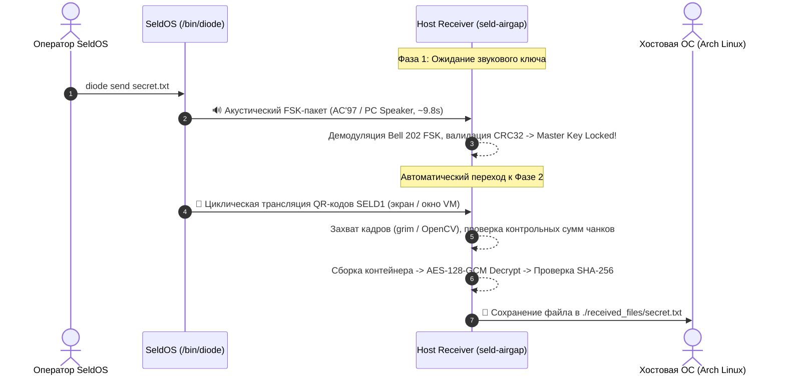

# SeldOS Sovereign Air-Gap Host Receiver (Arch Linux)

> **Zero-BadUSB / Unidirectional Optical & Acoustic Data Diode**  
> Полная изоляция защищенной системы: ноль флешек, ноль сетевых пакетов, физический однонаправленный канал (Data Diode).

---

## 1. Концепция и Философия

Классическая передача конфиденциальных данных через USB-накопители подвержена критическим векторам атак:
- **BadUSB:** перепрошивка контроллеров накопителя (Phison, Alcor, Silicon Motion) с эмуляцией HID-клавиатуры или сетевой карты для мгновенного RCE.
- **Двунаправленный канал заражения:** возможность передачи скрытых пейлоадов и метаданных от хоста в защищенную среду.
- **Утечки метаданных:** следы файловых систем, временные метки монтирования и артефакты разделов.

`seld-airgap` реализует **двухфакторный физический Air-Gap дата-диод**:
1. **Оптический дата-диод (Payload Channel):**
   - SeldOS циклически транслирует зашифрованный контейнер на мониторе в виде анимированных QR-кодов (`/bin/diode send <файл>`).
   - Приемник захватывает кадры с экрана через нативный Wayland `grim` / X11 либо через веб-камеру (Fountain-подобная сборка чанков).
   - Физически однонаправленный световой канал исключает обратную передачу любых данных.
2. **Акустический канал (Key Channel):**
   - Ключ шифрования передается через системный звук SeldOS (PC Speaker порт `0x61` / AC'97 DMA) частотной модуляцией **Bell 202 FSK** (1200 Гц — Space `0`, 2200 Гц — Mark `1`, 1800 Гц — пилот-тон).
   - Микросекундный тайминг TSC (`rdtsc`) в SeldOS устраняет фазовый джиттер, обеспечивая 0 мкс накопленного дрейфа.
   - Цифровой FSK-демодулятор приемника с дробным float-шагом и multi-rate сканированием автоматически захватывает аудиосигнал из наушников (PipeWire loopback) или микрофона, декодирует мастер-ключ и проверяет IEEE 802.3 CRC32.
3. **Криптографическая стойкость:**
   - Аутентифицированное шифрование **AES-128-GCM (AEAD)** с защитой от подделки (Fail-Closed).
   - Защита от Path Traversal при сохранении файлов.
   - Автоматическое затирание структур памяти (`Zeroize`) и резервное сохранение ключа в `~/.cache/seld-airgap/last_key.txt`.

---

## 2. Архитектура рабочего процесса (Workflow)



---

## 3. Установка на Arch Linux

### Зависимости:
```bash
sudo pacman -S python python-cryptography python-numpy python-scipy python-opencv alsa-utils grim
```
*(Опционально для максимальной скорости считывания QR: `sudo pacman -S zbar`)*

### Сборка и установка через PKGBUILD:
```bash
cd tools/host_diode
makepkg -si
```
Пакет устанавливает утилиту в систему под именами `seld-airgap` и `seld-diode-receiver`.

---

## 4. Сценарии использования

### Сценарий 1: Рабочий режим (Экран + Звук наушников / QEMU / VirtualBox)
*(Основной режим для виртуалки на том же ПК — камера и микрофон не требуются)*
```bash
seld-airgap --output ./received_files
```
1. **Фаза 1 (Звук):** Слушает системный аудиопоток через PipeWire/PulseAudio (`@DEFAULT_MONITOR@`). При старте `diode send` в SeldOS ключ блокируется автоматически за ~9.8 с. *(При необходимости можно нажать `Enter`, чтобы пропустить ожидание звука).*
2. **Фаза 2 (Экран):** Мгновенно считывает анимированные QR-коды с экрана через Wayland `grim` со скоростью 25+ FPS. При запуске под Hyprland утилита автоматически проверяет, на активном ли воркспейсе открыто окно виртуалки.
3. **Фаза 3 (Расшифровка):** Расшифровывает файл без ручного ввода пароля и сохраняет результат в `./received_files/`.

### Сценарий 2: Физический Air-Gap между двумя изолированными ПК
```bash
seld-airgap --webcam 0 --audio --mic --output ./received_files
```
Веб-камера хоста направляется на монитор SeldOS, а физический микрофон слушает системный динамик (PC Speaker).

### Сценарий 3: Режим только звукового ключа
```bash
seld-airgap --audio
```
Принимает акустический ключ, сохраняет его в файл и выводит параметры сессии (Session ID, Key ID, Master Key).

### Сценарий 4: Запуск верификационных тестов
```bash
seld-airgap --test
```
или запуск полного набора юнит-тестов:
```bash
pytest -q tests/test_diode_airgap.py
```

---

## 5. Команды в SeldOS (`/bin/diode`)

- `diode send <файл>` — зашифровать файл, передать ключ звуком (PC Speaker / AC'97) и вывести циклические QR-коды на экран.
- `diode qr <файл>` — тихий режим передачи (только QR-коды на экране).
- `diode beep` — повторно воспроизвести текущий акустический ключ в динамик.
- `diode keygen` — сгенерировать новый 40-строчный лист ключей в `/airgap.key`.
